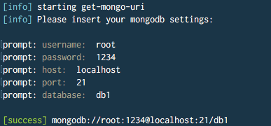
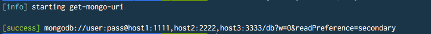

# get-mongo-uri
:pager: nodejs command line tool to build mongodb connection strings.

### Installation 
Open your terminal and type: `$ npm install get-mongo-uri -g`

### Use it with prompt
Open your terminal and type: `$ get-mongo-uri`.

  

### Use it with json file
Open your terminal and type: `$ get-mongo-uri -f "mongo-data.json"`.

  

Check it on [NPM](https://www.npmjs.com/package/get-mongo-uri)